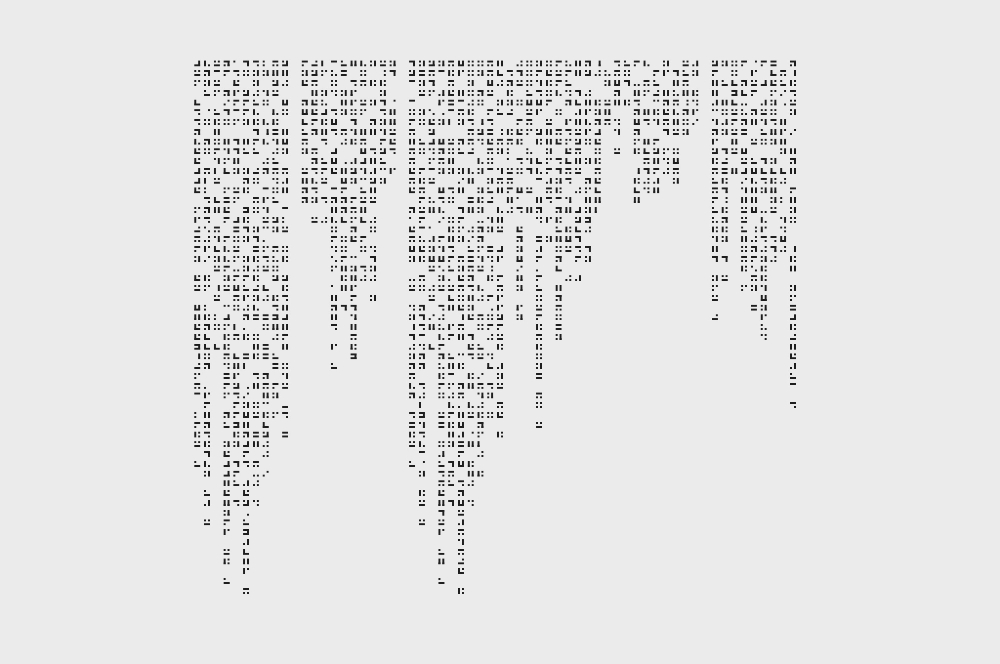
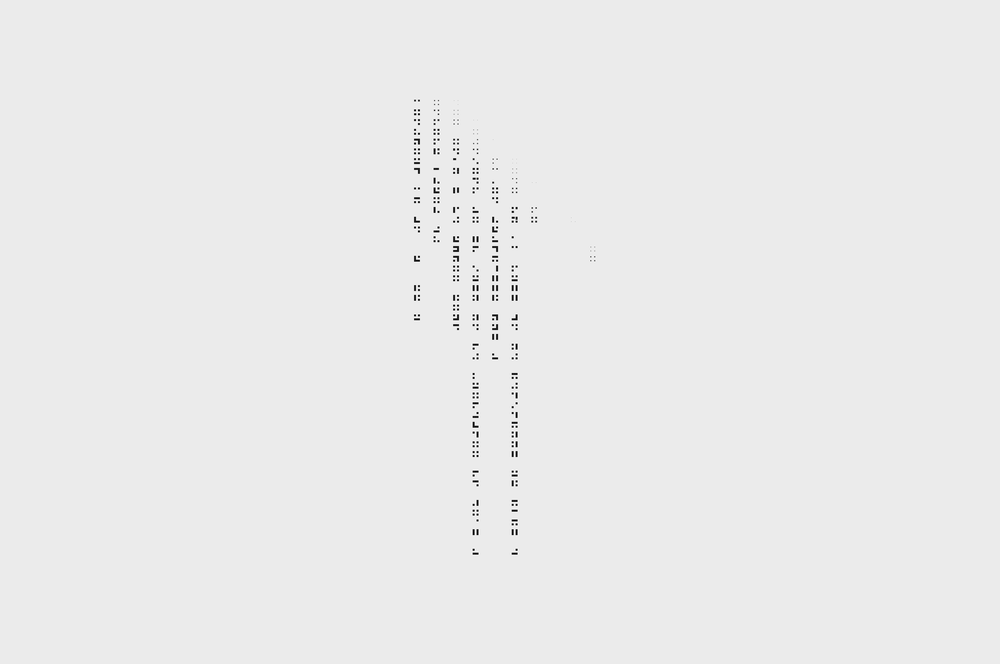
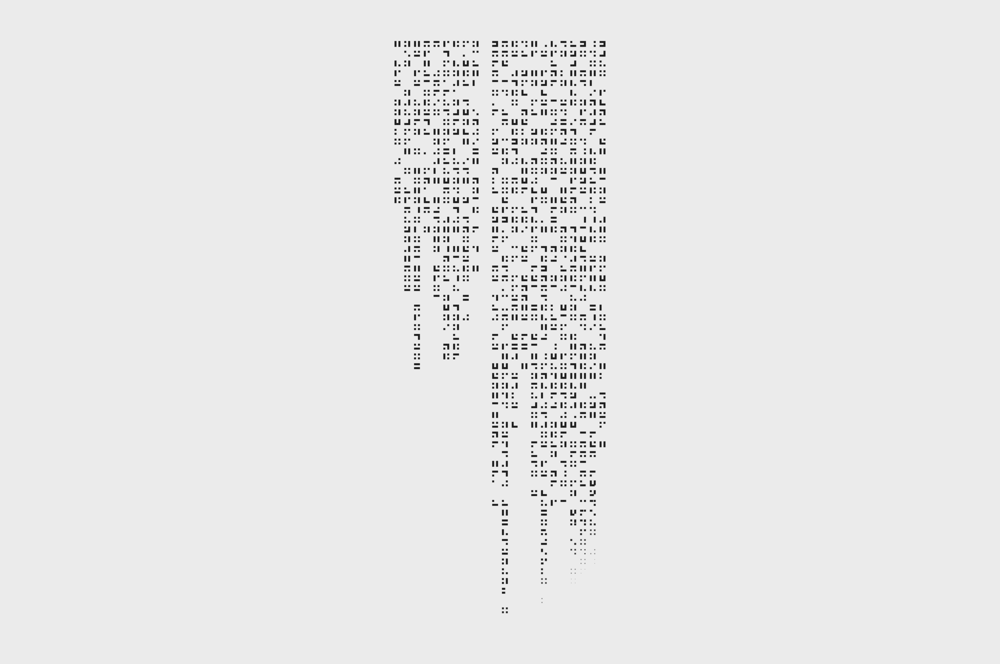
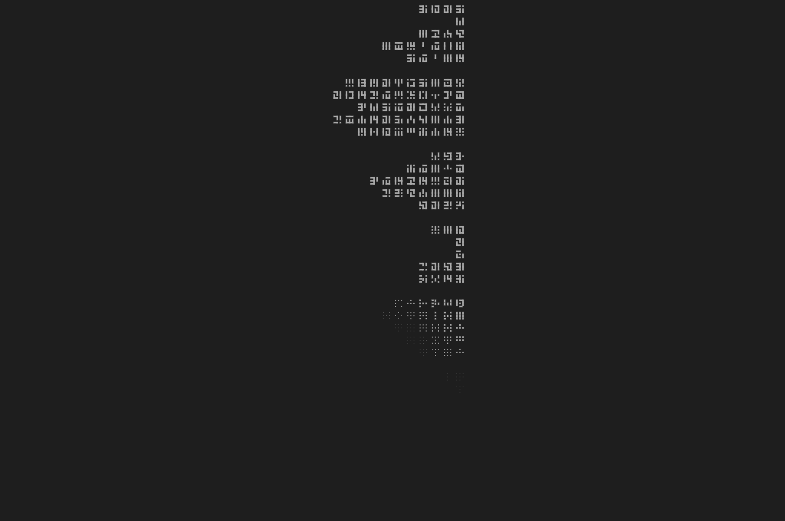
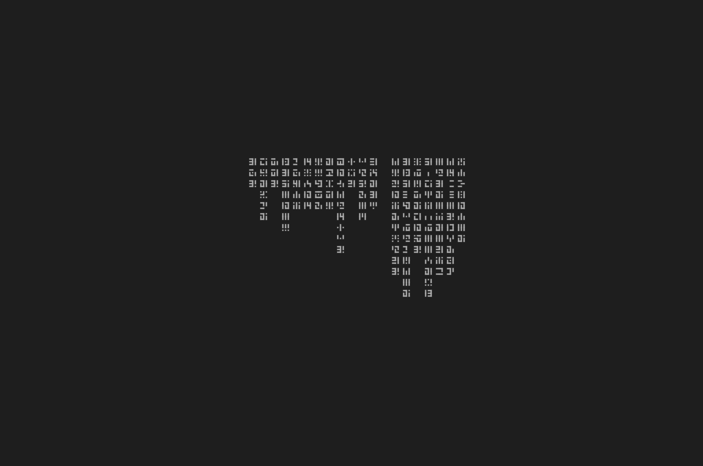
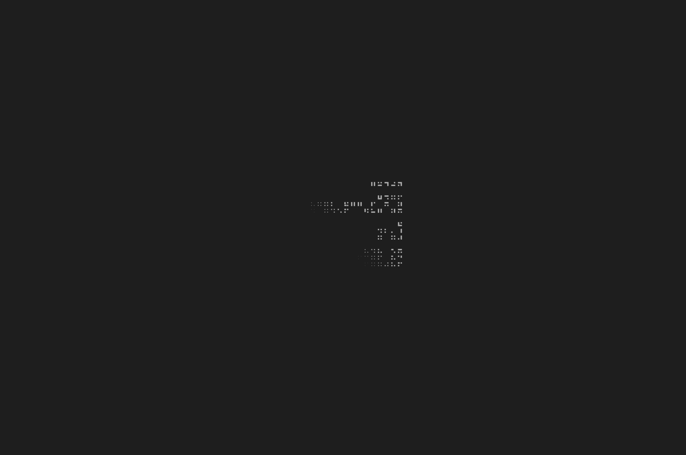
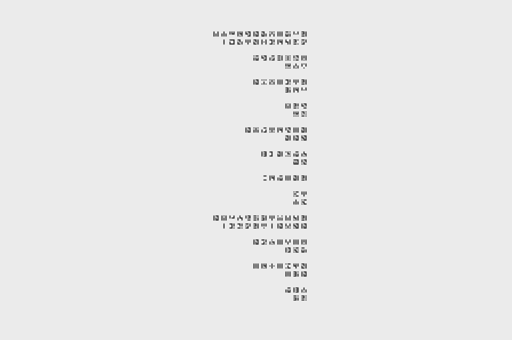
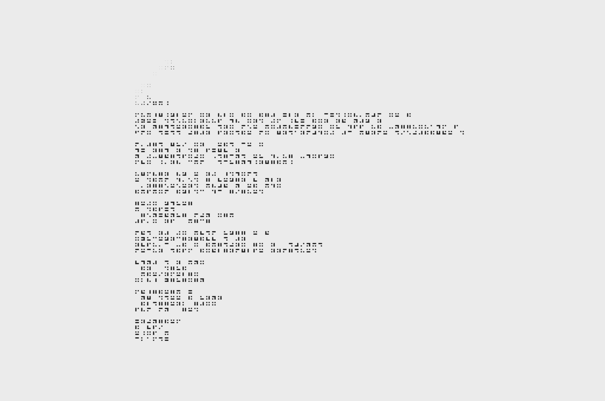

# Poetry Generator

Even though the alphabet of grid-aligned characters is randomly generated, the look and feel of each composition is far from random. In addition to choosing between left-to-right/right-to-left/top-to-bottom reading orders and phonetic vs pictographic character sets, the program generates repetition, stanzas, and even it's own version of "rhyme". Look closely.

[View in Browser](https://willy-vvu.github.io/PoetryGenerator/)

---

Assignment for: 21W.764 Word Made Digital

Learning Focus: Poetic Structures, Constrained Writing, Text Generation, Procedural Graphics and Animation

Media: Digital Poem, Generative Graphic, Animation, Website

Software: p5.js, JavaScript

Date: April 2017
